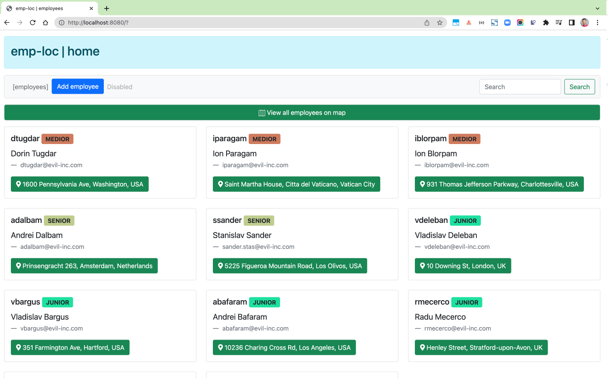
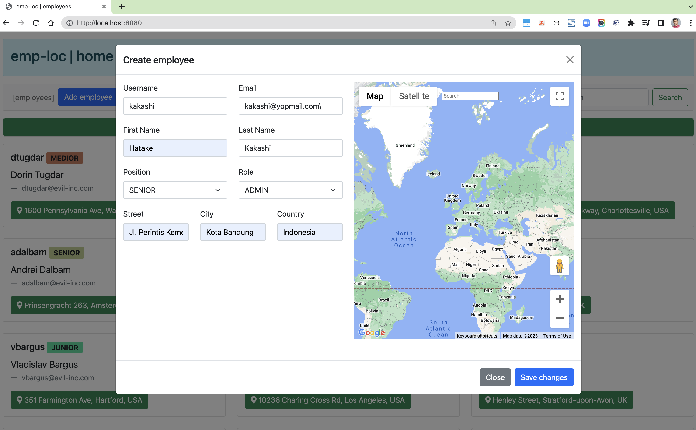
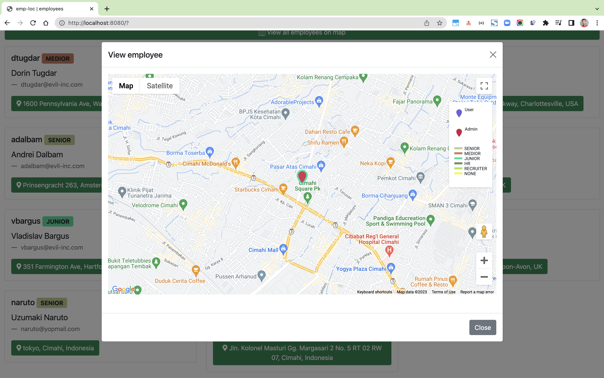

# spring-boot-googlemaps-sample2

### Things todo list

1. Clone this repository: `git clone https://github.com/hendisantika/spring-boot-googlemaps-sample2.git`
2. Navigate to the folder: `cd spring-boot-googlemaps-sample2`
3. Change your PostgreSQL credentials in `application.properties`
4. Run the application: `mvn clean spring-boot:run`
5. Open your favorite browser: http://localhost:8080

### Image screen shot

Home Page

Add new employee

View employee

